# Lakka for Gaboze Pocaio
> Interested in running [Lakka](http://www.lakka.tv/) on your small screen TFT?
> Look No Further, and Follow Along!

### Project Overview

[Lakka](http://www.lakka.tv/) is a lightweight Linux distribution that transforms a small computer into a full blown retrogaming console. It is the official Linux distribution of RetroArch and the libretro ecosystem.

Enable wide audience to run [Lakka](http://www.lakka.tv/) on their [Gaboze Pocaio](https://github.com/GameboyZero/GabozePocaio) *(Game Boy Pocket All In One)* Device.

[Gaboze Pocaio](https://github.com/GameboyZero/GabozePocaio) features both a 2.4" and the *updated* 2.6" screen (Gaboze Pocaio Plus)

### Purpose of Document

Provision clear and concise reference material. Understandable by any level of experience.

### Intended Audience

If you have built or purchased a [Gaboze Pocaio](https://github.com/GameboyZero/GabozePocaio), or have built a [Gaboze Pocaio +](https://github.com/GameboyZero/GabozePocaio#plus-edition) and wish to run [Lakka](http://www.lakka.tv/) instead of [RetroPie](https://retropie.org.uk/), then this **guide** is for you!

This guide also supports both **ILI9341** *(240x320)* and **ILI9342** *(320x240)* TFT driver boards from [ILITEK](http://www.ilitek.com/)

The ILI9341is typically available from 2.2" to 3.2" whereas the ILI9342 comes in less sizes ranging from 2.2" to 2.6"

## Pre Flight
> Things you need...

- [ ] A fresh copy of [Lakka](http://www.lakka.tv/get/)
- [ ] Raspberry Pi Model *(Zero, Zero W, Zero WH)*	
- [ ] Micro SD Card *(Even as small as 1GB)*
- [ ] A host computer to burn your Micro SD
- [ ] Software to burn your Micro SD with *(List of Options Below, in **Ease of Use** Order)*
	- [ ] [Etcher](https://etcher.io/)
	- [ ] [Apple Pi Baker](http://www.tweaking4all.com/hardware/raspberry-pi/macosx-apple-pi-baker/)
	- [ ] [Pi Bakery](http://www.pibakery.org/download.html)

#### Why make me download [Lakka](http://www.lakka.tv/get/) from source?
> Good question, here's why!

Yes, there are other sources *(GitHub, Google Code, Forums)* where you can download pre configured variants of operating systems such as [RetroPie](https://retropie.org.uk/) and [Lakka](http://www.lakka.tv/), but you don't know what else the developers have put in there do you? Or even worse, the developers may have installed malicious things without knowing.

We have seen everything from *Keystroke Loggers, Four Way WiFi Handshake, Reverse Tunnel, Snoop, Iptable Masquerading*...  ...you get the point. And we want to keep you safe. Again, it's about **trust** and **reputation**

You also get to lear a few things here and there ;)


## First Boot

> Vanilla [Lakka](http://www.lakka.tv/)

- [ ] HDMI Cable from Pi to Monitor
- [ ] USB Keyboard into USB on Pi
- [ ] Insert Imaged SD Card
- [ ] USB Cable to USB on Pi from Power Source *(You can use any USB Port on)*

|  |
|:--|
| *You will see the [Lakka](http://www.lakka.tv/) Flower show up on your screen* |


#### Automatic Resizing

> Just wait, let [Lakka](http://www.lakka.tv/) reboot

On first boot, you will see a list of *resizing* and *automatic commands* being run. Don't stress, this is normal.

| 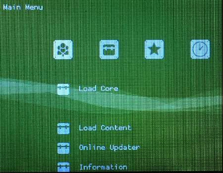 |
|:--|
| [Lakka](http://www.lakka.tv/) will reboot on it's own into the **Graphical User Inteface** *(GUI)* |


## Initial Setup

> Get your keyboard out

Navigate the GUI usingg your keyboard's arrow keys


#### Settings

| 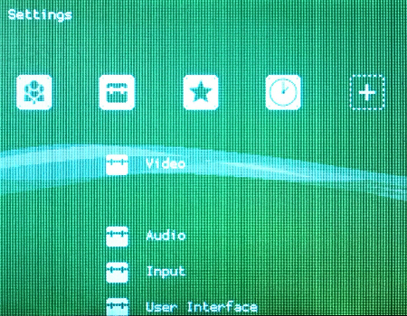 |
|:--|
| *Navigate to **Settings*** |


#### User Interface

| 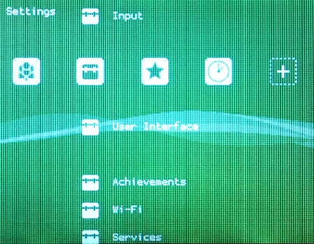 |
|:--|
| *Navigate to **User Interface** and hit **ENTER*** |


#### Advanced Settings

| 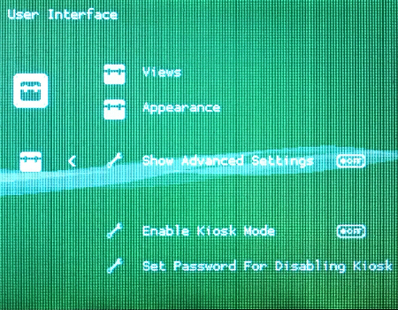 | 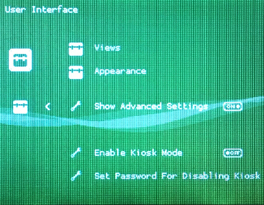 |
| :------------------------------------------------- | :------------------------------------------------ |
| *Navigate to **Show Advanced Settings***           | *and hit **RIGHT ARROW** to enable*               |


#### Enable Services

|  |  |
|:--|:--|
| *Navigate to back to **Services** (use BACKSPACE to go back a level* | *using **RIGHT ARROW** turn on **SSH Enable** and **SAMBA Enable*** |


#### Wi-Fi

| 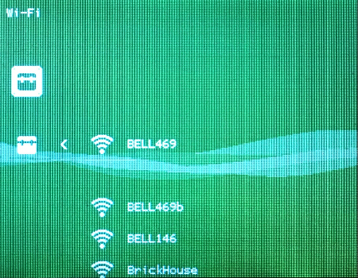 |
|:--|
| *Navigate to **Wi-Fi** and hit **ENTER*** |
| *Select Your SSID and hit **ENTER*** |
| *Enter your password and hit **ENTER*** |


#### Network Information

| 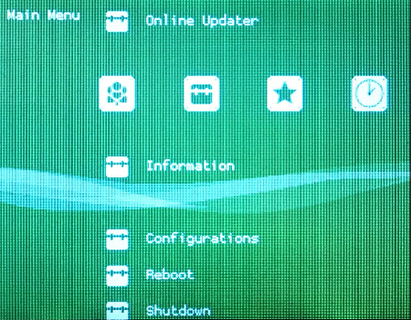 | 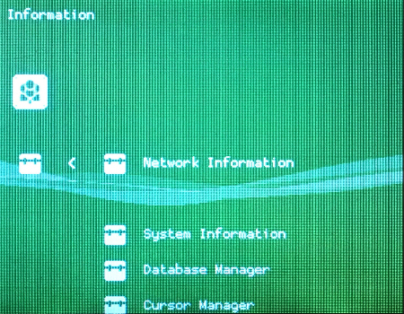 |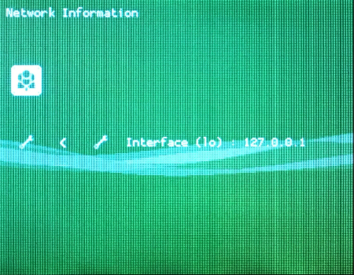 |
|:--|:--|
| *Navigate back to the **Main Menu** and Select **Configurations*** | *Select **Network Information*** | *Any connections will be listed here* |


#### More Input

| 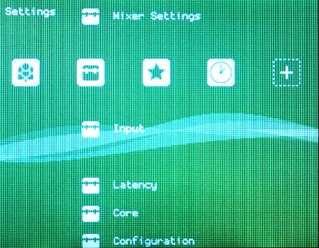 | 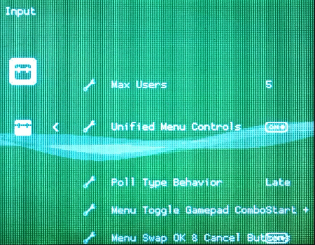 |
|:--|:--|
| *Navigate to **Settings** and select **Input*** |  *using **RIGHT ARROW** turn on **Unified Menu Controls***|

> WARNING: After setting the **Unified Menu Controls** to **ON** you will need to use the *Z* and *X* keys on your keyboard for **OK & Cancel**.

| 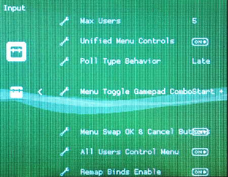 | 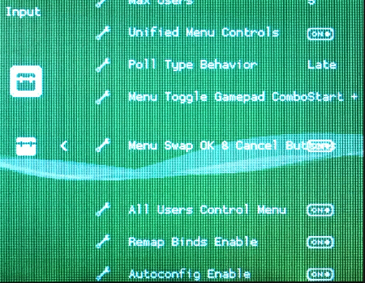 |
|:--|:--|
| *Navigate to **Menu Toggle Gamepad Combo** and select **Start + Select** (Used to exit games)* |  *Navigate to **Menu Swap OK & Cancel** and select **on** (Z and X are now reversed)*|


#### Saving the Configuration
> All that effort, better believe you want to save it!

| 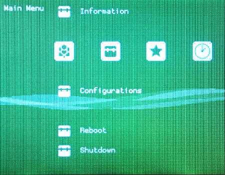 | 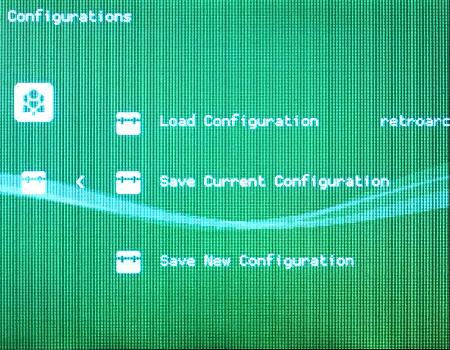 |
|:--|:--|
| *Navigate to **Main Menu** and select **Configurations*** |  *Select and confirm **Save Current Configuration***|

#### Shutdown or Reboot

|  |
|:--|
| *Navigate to **Main Menu** and select **Reboot** or **Shutdown** This depends on how much energy you have left* |


-------------


* Move tft folder to /storage
* ssh in
```
cd tft
chmod 777 ILI9341
chmod 777 ILI9342
```
* test
```
cd
tft/ILI9341
tft/ILI9342
```
ctrl+c to exit
* make it boot
```
nano /storage/.config/autostart.sh
```

```
# Uncomment appropriate line
#/storage/tft/ILI9341 & # 2.4" TFT
#/storage/tft/ILI9342 & # 2.6" TFT

# Keyboard GPIO
/storage/retrogame/retrogame &
```
ctrl+x
y

```
reboot now
```

```
shutdown now
```

mount sd
* Move pwm-audio-pi-zero-overlay.dtbo folder to /flash/overlays

config.txt
```
################################################################################
# 2.6 ILI9342
# 2.4 ILI9341
################################################################################
hdmi_group=2
hdmi_mode=87
hdmi_cvt=320 240 60 1 0 0 0
hdmi_force_hotplug=1
overscan_scale=1

################################################################################
# Audio
################################################################################
dtparam=audio=on
dtoverlay=pwm-audio-pi-zero-overlay
```

mount
move retrogame folder to /storage

* ssh in
```
nano /etc/udev/rules.d/10-retrogame.rules
SUBSYSTEM=="input", ATTRS{name}=="retrogame", ENV{ID_INPUT_KEYBOARD}="1"
```

cd ../retrogame/


