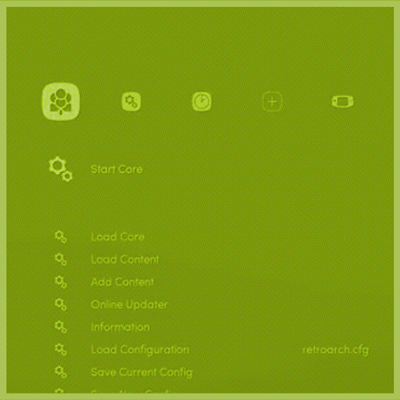

# Lakka for Gaboze Pocaio
> Interested in running [Lakka](http://www.lakka.tv/) on your small screen TFT?
> Look No Further, and Follow Along!



## Project Overview

[Lakka](http://www.lakka.tv/) is a lightweight Linux distribution that transforms a small computer into a full blown retrogaming console. It is the official Linux distribution of RetroArch and the libretro ecosystem.


Enable wide audience to run [Lakka](http://www.lakka.tv/) on their [Gaboze Pocaio](https://github.com/GameboyZero/GabozePocaio) *(Game Boy Pocket All In One)* Device.

[Gaboze Pocaio](https://github.com/GameboyZero/GabozePocaio) features both a 2.4" and the *updated* 2.6" screen (Gaboze Pocaio Plus)

## Purpose of Document

Provision clear and concise reference material. Understandable by any level of experience.

## Intended Audience

If you have built or purchased a [Gaboze Pocaio](https://github.com/GameboyZero/GabozePocaio), or have built a [Gaboze Pocaio +](https://github.com/GameboyZero/GabozePocaio#plus-edition) and wish to run [Lakka](http://www.lakka.tv/) instead of [RetroPie](https://retropie.org.uk/), then this **guide** is for you!

This guide also supports both **ILI9341** *(240x320)* and **ILI9342** *(320x240)* TFT driver boards from [ILITEK](http://www.ilitek.com/)

The ILI9341is typically available from 2.2" to 3.2" whereas the ILI9342 comes in less sizes ranging from 2.2" to 2.6"

## Pre Flight
> Things you need...

* [ ] A fresh copy of [Lakka](http://www.lakka.tv/get/)
* [ ] Raspberry Pi Model *(Zero, Zero W, Zero WH)*	
* [ ] Micro SD Card *(Even as small as 1GB)*
* [ ] A host computer to burn your Micro SD
* [ ] Software to burn your Micro SD with *(List of Options Below, in **Ease of Use** Order)*
	* [ ] [Etcher](https://etcher.io/)
	* [ ] [Apple Pi Baker](http://www.tweaking4all.com/hardware/raspberry-pi/macosx-apple-pi-baker/)
	* [ ] [Pi Bakery](http://www.pibakery.org/download.html)

### Why make me download [Lakka](http://www.lakka.tv/get/) from source?
> Good question, here's why!

Yes, there are other sources *(GitHub, Google Code, Forums)* where you can download pre configured variants of operating systems such as [RetroPie](https://retropie.org.uk/) and [Lakka](http://www.lakka.tv/), but you don't know what else the developers have put in there do you? Or even worse, the developers may have installed malicious things without knowing.

We have seen everything from *Keystroke Loggers, Four Way WiFi Handshake, Reverse Tunnel, Snoop, Iptable Masquerading*...  ...you get the point. And we want to keep you safe. Again, it's about **trust** and **reputation**

You also get to learn a few things here and there ;)

## Available for
> But Not Limited To

| Out Now | Build Your Own | Out Soon |
|:--:|:--:|:--:|
|  | | |
| *Gaboze Pocaio* | *Gaboze Pocaio Plus* | *Gaboze Pocaio ???* |

## First Boot

> Vanilla [Lakka](http://www.lakka.tv/)

* [ ] HDMI Cable from Pi to Monitor
* [ ] USB Keyboard into USB on Pi
* [ ] Insert Imaged SD Card
* [ ] USB Cable to USB on Pi from Power Source *(You can use any USB Port on)*

|  |
|:--:|
| *You will see the [Lakka](http://www.lakka.tv/) Flower show up on your screen* |

### Automatic Resizing

> Just wait, let [Lakka](http://www.lakka.tv/) reboot

On first boot, you will see a list of *resizing* and *automatic commands* being run. Don't stress, this is normal.

|  |
|:--:|
| [Lakka](http://www.lakka.tv/) will reboot on it's own into the **Graphical User Inteface** *(GUI)* |

## Initial Setup
> Get your keyboard out

Navigate the GUI using your keyboard's arrow keys, what follows is a paint by numbers (well follow the pictures) easy step by step initial setup

### Settings

|  |
|:--:|
| *Navigate to **Settings*** |

### User Interface

|  |
|:--:|
| *Navigate to **User Interface** and hit **ENTER*** |

### Advanced Settings

|  |  |
|:--:|:--:|
| *Navigate to **Show Advanced Settings***           | *and hit **RIGHT ARROW** to enable*               |

### Enable Services

|  |  |
|:--:|:--:|
| *Navigate to back to **Services** (use BACKSPACE to go back a level* | *using **RIGHT ARROW** turn on **SSH Enable** and **SAMBA Enable*** |

### Wi-Fi

|  |
|:--:|
| *Navigate to **Wi-Fi** and hit **ENTER*** |
| *Select Your SSID and hit **ENTER*** |
| *Enter your password and hit **ENTER*** |

### Network Information

|  |  | |
|:--:|:--:|:--:|
| *Navigate back to the **Main Menu** and Select **Configurations*** | *Select **Network Information*** | *Any connections will be listed here* |

### More Input

|  |  |
|:--:|:--:|
| *Navigate to **Settings** and select **Input*** |  *using **RIGHT ARROW** turn on **Unified Menu Controls***|

> WARNING: After setting the **Unified Menu Controls** to **ON** you will need to use the *Z* and *X* keys on your keyboard for **OK & Cancel**.

|  |  |
|:--:|:--:|
| *Navigate to **Menu Toggle Gamepad Combo** and select **Start + Select** (Used to exit games)* |  *Navigate to **Menu Swap OK & Cancel** and select **on** (Z and X are now reversed)*|

### Saving the Configuration
> All that effort, better believe you want to save it!

|  |  |
|:--:|:--:|
| *Navigate to **Main Menu** and select **Configurations*** |  *Select and confirm **Save Current Configuration***|

### Shutdown or Reboot

|  |
|:--:|
| *Navigate to **Main Menu** and select **Reboot** or **Shutdown** This depends on how much energy you have left* |


## FTP (SCP)
> Let's get some files onto our SD Card

With the Raspberry Pi booted and running Lakka, we will now be moving some files onto the SD Card.
*If you are familiar command line **Secure Copy Protocol** (SCP) you can use that, any **File Transfer Protocol** (FTP) software works just as well and is typically easier.*

### What you need
* [ ] Computer from which you will be working
* [ ] Terminal (Shell) Software
* [ ] FTP Software (Recommended)

### Assets from this repository
> Open your Terminal App

Grab this repo
```shell
$ git clone https://github.com/32teeth/GabozePocaioLakka.git 
```

Some files are for reference, some are required, but we figured we give you the whole picture of what will be going one next.

### Move files to [Lakka](http://www.lakka.tv/)
> By default, only the **/Storage** folder is writable on [Lakka](http://www.lakka.tv/)

First, you will need to know the IP address of your Raspberry Pi
*Here's a polite reminder from before*

|  |  | |
|:--:|:--:|:--:|
| *Navigate back to the **Main Menu** and Select **Configurations*** | *Select **Network Information*** | *Any connections will be listed here* |

The *user:password* combo for all *vanilla* [Lakka](http://www.lakka.tv/) builds is **root:root**

You will be moving the **retrogame** and **tft** folders to [Lakka](http://www.lakka.tv/) */storage* folder

#### SCP
##### Backgrounds
> Background Images for Lakka
```shell
$ scp -r ~/[path_to_where_you_cloned_the_repo]/backgrounds root@[ip_of_your_raspberry_pi]:
```

##### Retro Game
> Retrogame Service and Config
```shell
$ scp -r ~/[path_to_where_you_cloned_the_repo]/retrogame root@[ip_of_your_raspberry_pi]:
```

##### Displays
> ILI9341/2 Display Drivers
```shell
$ scp -r ~/[path_to_where_you_cloned_the_repo]/tft root@[ip_of_your_raspberry_pi]:
```

##### Retroarch
> Retroarch Configuration 
```shell
$ scp ~/[path_to_where_you_cloned_the_repo]/retroarch/retroarch.cfg root@[ip_of_your_raspberry_pi]:.config/retroarch
```

#### FTP
Login into the IP address using
*username*:**root**
*password*:**root**

Drag and drop **retrogame** and **tft** folders into the */storage* folder
Drag and drop **retroarch.cfg** into */storage* folder

## SSH
> Back to your computer

Now with all the above items in place, it's time to edit a few *files* and *create commands*

### SSH into your Pi

In your terminal applications, **SSH** into the pi, the password is *root*

|  |  |
|:--:|:--:|
| *ssh in via terminal* |  *password is **root*** |

```shell
$ ssh root@[ip_address]
```

By default, you will be enter into the */storage* folder.

### Change access permissions to the *display drivers*

|  |  |
|:--:|:--:|
| *ssh success* |  *access premission change* |

```shell
$ chmod 777 tft/ILI9341 tft/ILI9342
```

### Change access permissions to *retrogame*

|  |
|:--:|
| *access premission change* |

```shell
$ chmod 777 -R retrogame
```

### Create an autostart script

|  | | | |
|:--:|:--:|:--:|:--:|
| *create script file* | *blank file* | *edit the file* | *uncomment and save* |

```shell
$ nano /storage/.config/autostart.sh
```
* Paste the below block
```shell
# Uncomment appropriate line
#/storage/tft/ILI9341 & # 2.4" TFT
#/storage/tft/ILI9342 & # 2.6" TFT

# Keyboard GPIO
/storage/retrogame/retrogame &
```
* [ ] uncomment the ILI9341 line if you have an original **Gaboze Pocaio** with a 2.4" screen
* [ ] uncomment the ILI9342 line if you have built a **Gaboze Pocaio *Plus*** with a 2.6" screen

```shell
# Uncomment appropriate line
#/storage/tft/ILI9341 & # 2.4" TFT
/storage/tft/ILI9342 & # 2.6" TFT

# Keyboard GPIO
/storage/retrogame/retrogame &
```
Now hit *ctrl+x* and hit *y*

### Update the Rules

|  | | |
|:--:|:--:|:--:|
| *create script file* | *blank file* | *edit and save file* |

Create a rules file
```shell
nano /etc/udev/rules.d/10-retrogame.rules
```

Paste This
```shell
SUBSYSTEM=="input", ATTRS{name}=="retrogame", ENV{ID_INPUT_KEYBOARD}="1"
```

Hit *ctrl+x* and hit *y*

## Home Stretch
> Time to shutdown and edit the main *config*

Your SSH session should still be open on your desktop.

|  |< img src=images/ssh-012.jpg/> |
|:--:|:--:|
| *back to shell* | *shutdown* |

* Shutdown
```shell
$ shutdown now
```

Once the Raspberry Pi has fully shutdown (no activity light blinking)
* [ ] Pull out the SD Card
* [ ] Mount the SD Card on your computer

Once the SD Card mounts onto your computer you will see a directory called *overlays*

|  |
|:--:|
| *SD Card files* |

Drag and drop the file named **pwm-audio-pi-zero-overlay.dtbo** into that directory (it's in the repo you downloaded)
Once that is done, find the file named **config.txt** located in the root of the SD Card
Open that file with your favorite text editor and after the lines

```shell
################################################################################
# End of default configuration
################################################################################
```

Paste this
```shell
################################################################################
# 2.6 ILI9342
# 2.4 ILI9341
################################################################################
hdmi_group=2
hdmi_mode=87
hdmi_cvt=320 240 60 1 0 0 0
hdmi_force_hotplug=1
overscan_scale=1

################################################################################
# Audio
################################################################################
dtparam=audio=on
dtoverlay=pwm-audio-pi-zero-overlay
```

* Eject the SD Card
* Put it back in the Pi
* Boot the Pi 
* Enjoy the fruits of your labor!